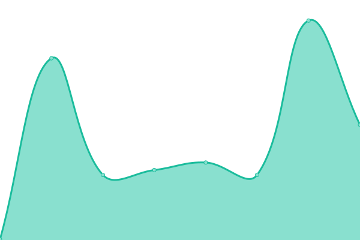
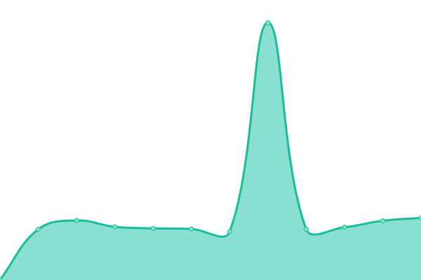
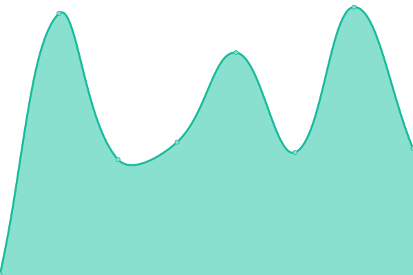
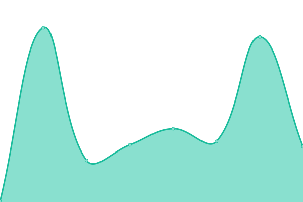

# [📈 Live Status](https://cssllc.github.io/uptime-monitor): <!--live status--> **🟩 All systems operational**

This repository contains the open-source uptime monitor and status page for [Caleb Stauffer Style](https://develop.calebstauffer.com), powered by [Upptime](https://github.com/upptime/upptime).

With [Upptime](https://upptime.js.org), you can get your own unlimited and free uptime monitor and status page, powered entirely by a GitHub repository. We use [Issues](https://github.com/cssllc/uptime-monitor/issues) as incident reports, [Actions](https://github.com/cssllc/uptime-monitor/actions) as uptime monitors, and [Pages](https://cssllc.github.io/uptime-monitor) for the status page.

<!--start: status pages-->
<!-- This summary is generated by Upptime (https://github.com/upptime/upptime) -->
<!-- Do not edit this manually, your changes will be overwritten -->
<!-- prettier-ignore -->
| URL | Status | History | Response Time | Uptime |
| --- | ------ | ------- | ------------- | ------ |
|  [develop.calebstauffer.com](https://develop.calebstauffer.com) | 🟩 Up | [develop-calebstauffer-com.yml](https://github.com/cssllc/uptime-monitor/commits/HEAD/history/develop-calebstauffer-com.yml) | 

 121ms
     
 | 

<a href="https://monitor.calebstauffer.com/history/develop-calebstauffer-com">100.00%</a>
    

|  [rugbyamericasnorth.com](https://rugbyamericasnorth.com) | 🟩 Up | [rugbyamericasnorth-com.yml](https://github.com/cssllc/uptime-monitor/commits/HEAD/history/rugbyamericasnorth-com.yml) | 

 258ms
     
 | 

<a href="https://monitor.calebstauffer.com/history/rugbyamericasnorth-com">100.00%</a>
    

|  [strikepointmedia.com](https://www.strikepointmedia.com) | 🟩 Up | [strikepointmedia-com.yml](https://github.com/cssllc/uptime-monitor/commits/HEAD/history/strikepointmedia-com.yml) | 

 309ms
     
 | 

<a href="https://monitor.calebstauffer.com/history/strikepointmedia-com">100.00%</a>
    

|  [therealtymedics.com](https://www.therealtymedics.com) | 🟩 Up | [therealtymedics-com.yml](https://github.com/cssllc/uptime-monitor/commits/HEAD/history/therealtymedics-com.yml) | 

 132ms
     
 | 

<a href="https://monitor.calebstauffer.com/history/therealtymedics-com">100.00%</a>
    

<!--end: status pages-->

[**Visit our status website →**](https://cssllc.github.io/uptime-monitor)

## 📄 License

- Powered by: [Upptime](https://github.com/upptime/upptime)
- Code: [MIT](./LICENSE) © [Caleb Stauffer Style](https://develop.calebstauffer.com)
- Data in the `./history` directory: [Open Database License](https://opendatacommons.org/licenses/odbl/1-0/)
